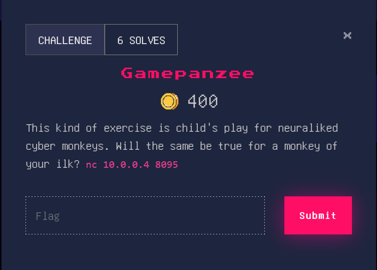

# Gamepanzee

Here is the script that works for the part 4/4 of the challenge Gampanzee. I didn't save the other scripts, if you want, you can go through the previous commits to see what looked like the script to solve the parts 1, 2 and 3 of the challenge (look at the last commit with the number of the part in the first send to see the version that worked).