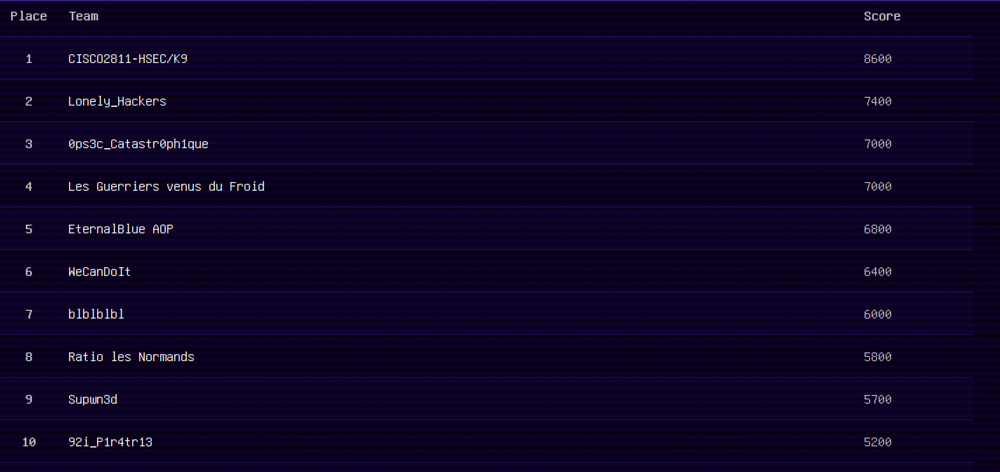
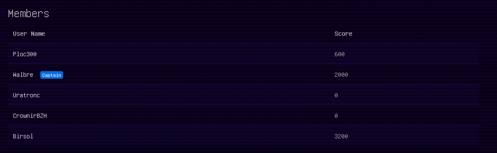
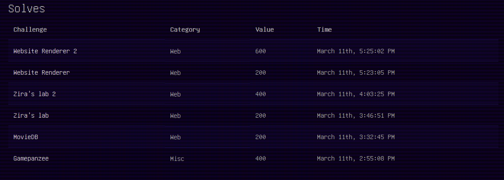

# ZITF 2023

This edition of ZITF had 35 challenges. My team and I did 15 of them and we ended in 8th place.

I solved 6 challenges during this ctf. And I'll do the write up of 5 of them (the code of the 6th will be in this repo but I won't write about it).

Here are the write up, enjoy :

- [MovieDB](./writeups/MovieDB/)

- [Website Render 1 and 2](./writeups/Website_Render_1%262/)

- [Ziro's lab 1 and 2](./writeups/Ziros_lab_1%262/)

The code of Gamepanzee is [here](./gamepanzee/)