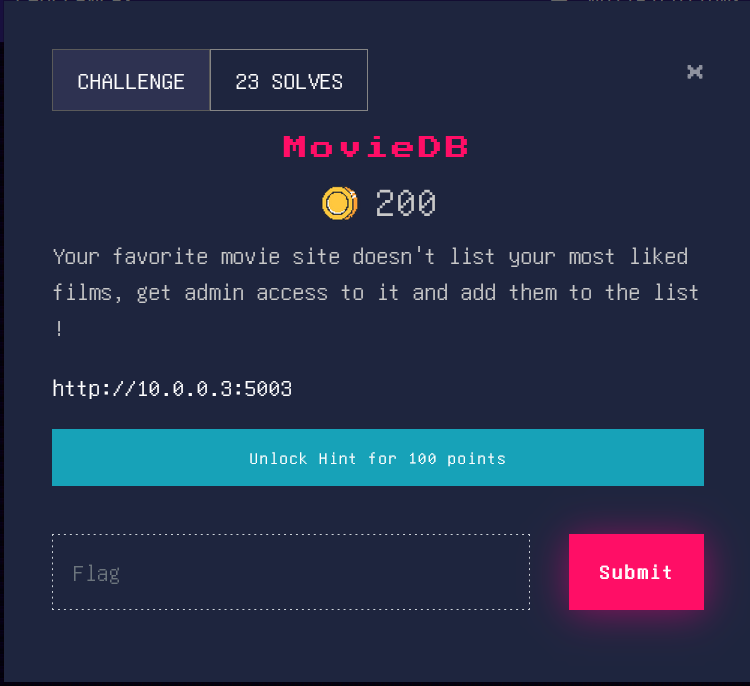
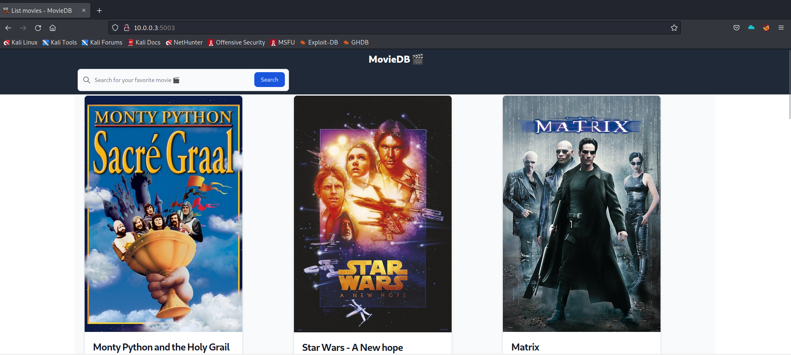
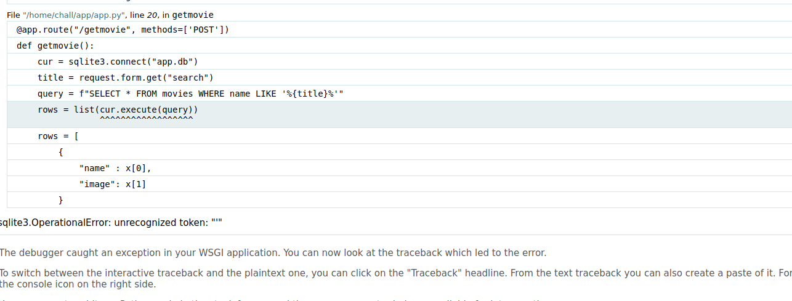
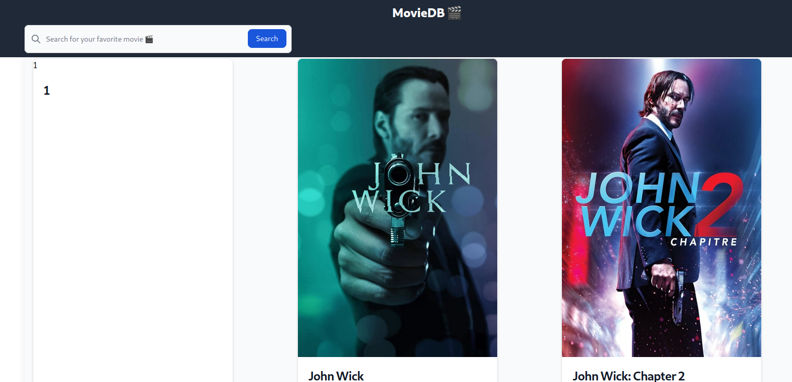
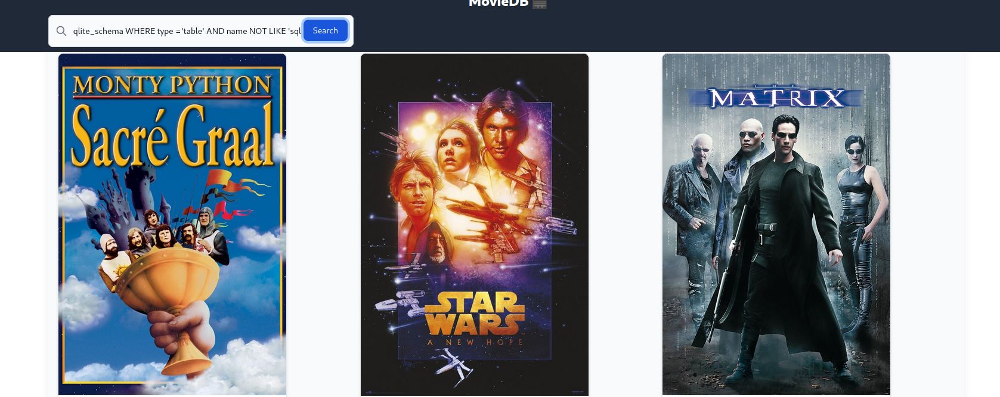
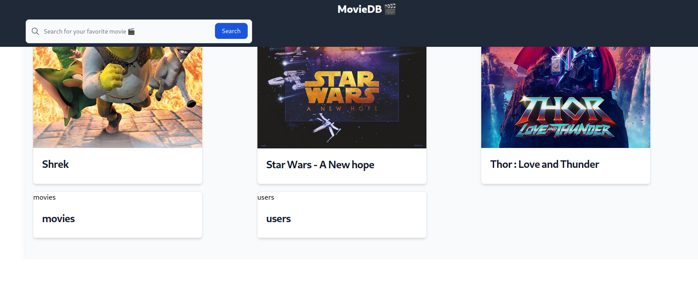
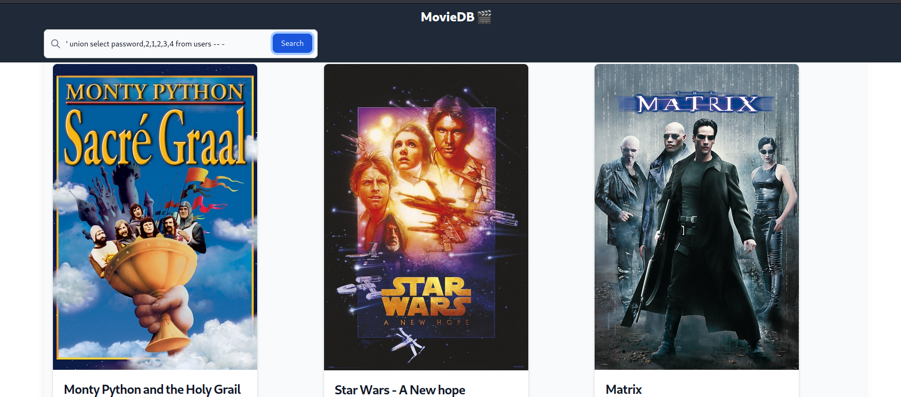
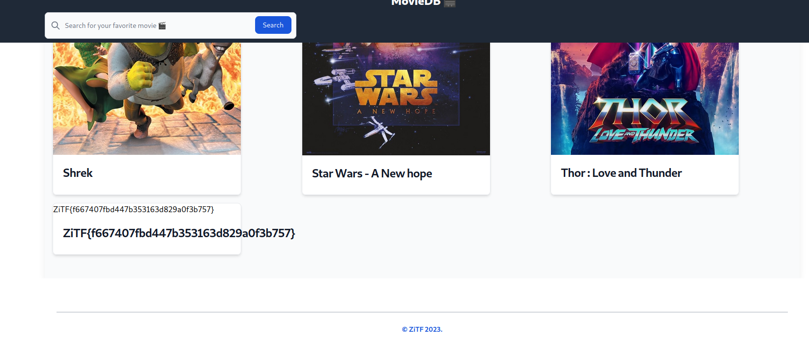

# MovieDB



## Scouting

The website is a simple website that displays film, based on a search engine.



The first reflex in this situation if to try some sql injection. So I tried putting a simple quote in the search bar, to see what happend.



When I put a quote, the website raised an error, displaying the SQL querry used by the backend.

```sql
SELECT * FROM movies name LIKE '%{title}'
```

This error also gived the information that this website was powered up by sqlite.

Now that we had most of the needed informations, it was time for exploiting the vulnerability.

## Exploiting

It was said in the challenge description that we needed to get the admin access, to do so, I fisrtly wanted to listed all the tables in that DB.

The simplest way to do it was to use union based SQL injection. This type of SQL injections rely on the `UNION` statement. With this statement, it's possible to add the values of a SELECT after another, as long as he has the same number of columns.

So, I needed to get the number of columns returned by the SQL querry that we got above. To do it, I used the payload

```sql
' union SELECT 1,2,3,... -- -
```

And I tried with one more number each time until the querry worked.




As we can see, the payload

```sql
' UNION SELECT 1,2,3,4,5,6 -- -
```
didn't returned an error, so I could assume that there was 6 columns in the table movies.

Now that I knew the number of rows needed in the SQL statement, I could start enumerating the tables. In sqlite, all tables can be listed by using

```sql
SELECT name FROM sqlite_schema WHERE type ='table' AND name NOT LIKE 'sqlite%';
```

If I adjust it to our payload, it gives.

```sql
' UNION SELECT name, 2, 3, 4, 5, 6 FROM sqliteschema WHERE type ='table' AND name NOT LIKE 'sqlite%';
```





As expected, I found the table movies, but another one appeared, called users.

From now on, I tried to retrieve the data in this table. To do it, I simply reused our union based sql injection payload.

```sql
' union select password,2,1,2,3,4 from users -- -
```





And here we got the flag.